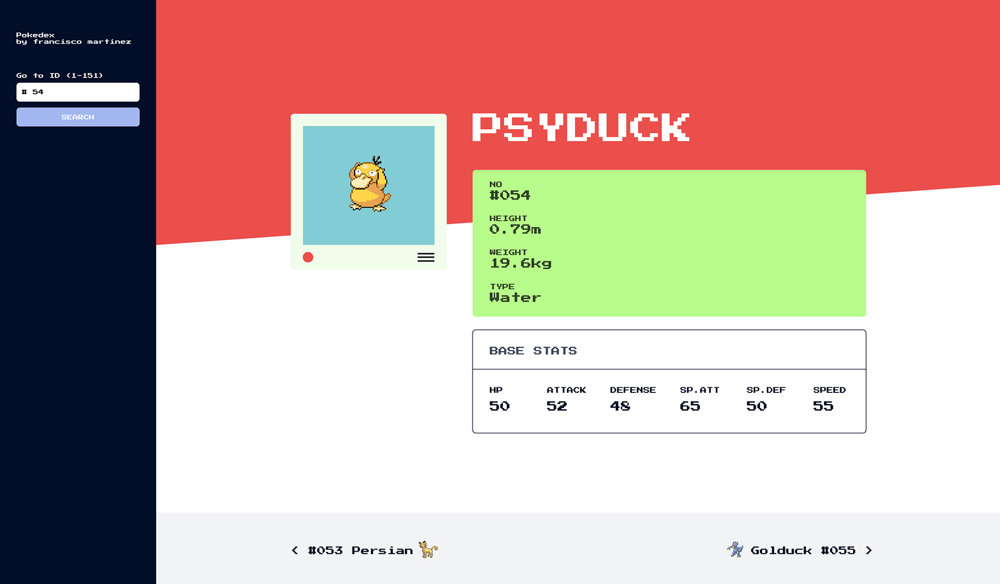

# foxp2 🦊

__Hello, there!__

You have been tasked to create an interactive Pokedex, using data from
[`Pokeapi`](https://pokeapi.co). The
[`Documentation`](https://pokeapi.co/docs/v2.html) is pretty extensive and should
provide you with all the data you need in order to complete this project.

The primary endpoint and fields that we will be using is as follows:

| https://pokeapi.co/docs/v2.html/#pokemon
| -
| `id`
| `name`
| `weight`
| `height`
| `stats`
| `types`
| `sprites`

And so you don't need to think about design, you can closely follow the mockup we have provided below.



It is expected that the Pokedex can perform the following.

* [x] Grab Pokemon data from Pokeapi and present as per mockup.
* [x] Present and navigate to the next and previous Pokemon (see bottom of mockup).
* [x] Ability to navigate directly to a specific Pokemon based on its id (see top-left of mockup).

## Setup

Before we get started let's make sure that you are setup correctly. First make
sure you have the latest version of [`Node/NPM`](https://nodejs.org) installed
before proceeding.

Next, clone this repo, and run `npm install` to download all the required dependencies needed to run this app.

```
$ git clone https://github.com/mango-chutney/foxp2.git
$ cd foxp2
$ npm install
```

Run `npm run start` to start the development server. You will now be able to access the app in your browser by navigating to `http://localhost:3000`.

```
$ npm run start

Compiled successfully!

You can now view foxp2 in the browser.

  Local:            http://localhost:3000/
  On Your Network:  http://192.168.1.109:3000/

Note that the development build is not optimized.
To create a production build, use npm run build.
```

Now check out the `./src` directory. There are two files.

 - `index.js` - root react component
 - `index.css` - global styles

These will be your starting point, don't fret, there is no right or wrong way to take on this project, just try your best and if you are having any trouble or if something isn't quite working as expected, don't be afraid to contact `jason@mangochutney.com.au` and `francis@mangochutney.com.au` for help.

And that about does it. When you are all done, send your finished app (preferrably a link to your repository) through to `jason@mangochutney.com.au`, `francis@mangochutney.com.au` and `tristan@mangochutney.com.au`. Good
luck!

___

_**This app was bootstrapped with [`Create React App`](https://github.com/facebook/create-react-app). Check out the [`Documentation`](https://github.com/facebook/create-react-app/blob/master/packages/react-scripts/template/README.md) for further information related to the build.**_
