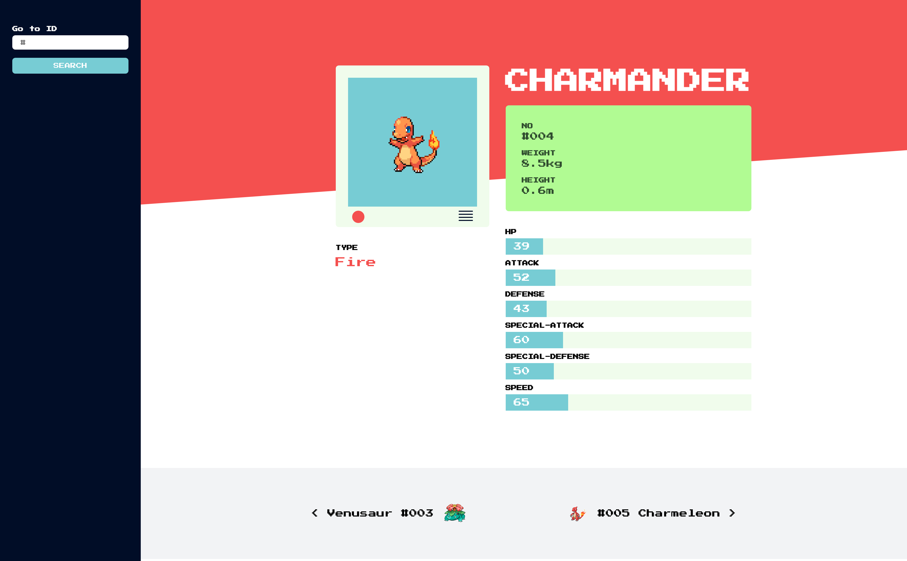

# foxp2 🦊

## The setup

Hello, there!

Before we get started let's make sure that you are setup correctly. First make
sure you have the latest version of [`Node/NPM`](https://nodejs.org) installed
before proceeding.

Download this repo, and inside the parent directory run `npm install` to grab
all the packages you will need to begin. Now time to get our
[`Express`](https://expressjs.com) server started, run `npm run start`, this
will serve all our files located in `./build`. Ok, next we want to get our
client side code running, [`Webpack`](https://webpack.js.org) will be helping us
out with this. We want to make sure our server continues to run so in a new
terminal window run `npm run build` to generate our script bundle. With this
command running, Webpack will watch and rebuild our bundle whenever we make
changes to the code.

Now check it out, if you navigate to `http://127.0.0.1:3000`, the project setup
should be all complete. Looks like it's time to get started!

One last thing. This repo is simply a means to help you get started. The
boilerplate we have provided is opinionated to use React (since most of our own
projects are built using it), but you are not required to use it and are welcome
to build this with tools you are comfortable with.

## The objective

The task will be to create an interactive Pokedex, using data from
[`Pokeapi`](https://pokeapi.co). The
[`Documentation`](https://pokeapi.co/docsv2) is pretty extensive and should
provide you with all the data you need in order to complete this project.

The primary endpoint and fields that we will be using are as follows:

| https://pokeapi.co/docsv2/#pokemon
| -
| `id`
| `name`
| `weight`
| `height`
| `stats`
| `types`
| `sprites`

And so you don't need to think about design, you will be recreating the
following mockup (feel free to add your own visual flair if you would like).

It is expected that the Pokedex can perform the following.

* [x] Grab relevant Pokemon data from Pokeapi and present as per mockup.
* [x] Ability to search for a Pokemon by its number.

And if you are feeling adventurous.

* [x] Presenting the `id`, `name`, and `sprites` for the next and previous
      Pokemon (as seen on the bottom of the mockup).
* [x] Ability to route directly to a specific Pokemon, for example navigating to
      `http://127.0.0.1:3000/25` will present Pikachu's entry.

## The end

And that about does it. When you are all done, send your finished project
through to `jason@mangochutney.com.au` and `tristan@mangochutney.com.au`. Good
luck!

__Stuck?__

_If something isn't looking quite right or you just need to ask a question,
don't be afraid to contact `jason@mangochutney.com.au`_
